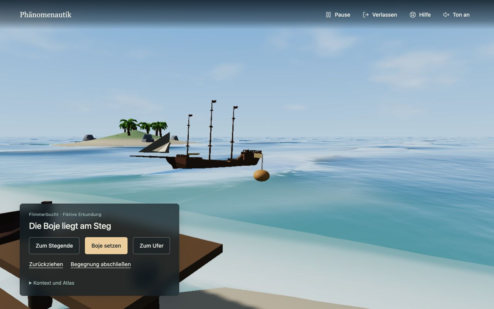
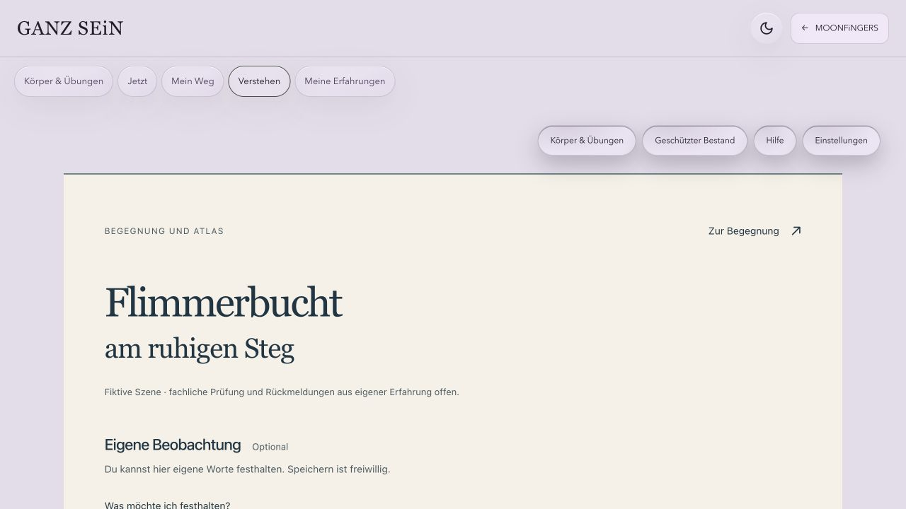
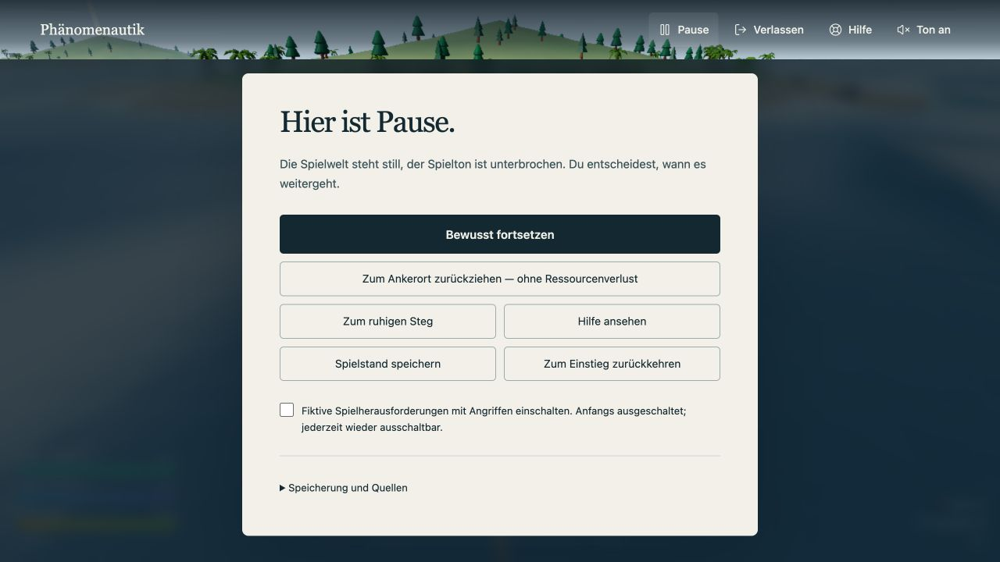

# Phänomenautik — lokale Lieferung, aktualisiert am 10. Oktober 2026

**Gestaltungskorrektur vom 10. Oktober:** Nach der Zurückweisung des statischen Entwurfs wurden der jüngste Kimi-Quellstand und die laufende Fassung angesehen. Einstieg und Flimmerbucht zeigen jetzt die vorhandene bewegte 3D-Welt. Blickwechsel und Boje verändern die Szene direkt. Die [aktuellen Browseransichten](gestaltungsnachweis.md) ersetzen die zuvor gezeigte Illustration als Gestaltungsnachweis. Die technische Bildrate schwankt; konstante 60 FPS und physikalische Korrektheit sind nicht nachgewiesen. Die folgenden ursprünglichen Schutz- und Atlasbefunde stammen vom 9. Oktober, soweit kein neuer Prüfzeitpunkt angegeben ist.

**Speicherkorrektur vom 10. Oktober:** Ältere offene Spielansichten dürfen einen inzwischen geänderten oder gelöschten Stand nicht überschreiben. Der vorhandene Speicherpfad vergleicht die ursprünglichen Bytes vor dem Schreiben und meldet einen Konflikt verständlich. Der erweiterte Audit bestand mit 349 Assertion-Aufrufen, die Baseline mit 27. Zwei echte Browser-Tabs bestätigten den Schutz einschließlich Schließen und Neuladen; [Bild und Ablauf](gestaltungsnachweis.md) sind gesichert. Vergleich und Schreiben sind keine atomare Mehrtab-Transaktion. Der abschließende TypeScript- und Produktionsbuild nach dieser Korrektur bestand; die bestehende Bundlegrößenwarnung bleibt.

Die Schutzfunktionen, eine vollständige milde Begegnung und der Rückweg über den bestehenden Atlas sind lokal umgesetzt. Die Browserprüfung zeigt eine gespeicherte und wieder geöffnete technische Notiz sowie den erhaltenen Begegnungsschritt. Fachliche Prüfung, Rückmeldungen von Menschen mit eigener Erfahrung und menschliche Gestaltungsabnahme bleiben **Prüfung offen**. Eine klinische Wirkung ist nicht nachgewiesen.

## Bestand und Arbeitsgrenzen

Der aktuelle Spielstand des Quellprojekts stammt aus `ralfarminkirchner-netizen/phaenomenautik-3`, Branch `main`, Ausgangscommit `3343519` (Graph-Fundament). Da zunächst nur eine ältere Lesekopie vorhanden war, wurde das aktuelle Repository unter `/Volumes/ThunderBolt4_2TB/Development/Projects/phaenomenautik-3` ausgecheckt. Die historische Lesekopie unter `Development/Tmp/phaenomenatlas-fassungen-lesekopie-20261006` blieb erhalten. Keine parallele Spielarchitektur wurde aufgebaut.

Der vorhandene Atlas liegt unter `/Volumes/ThunderBolt4_2TB/MeineApps/dein-sein-astra/astra-neubau`. Dort wurden ausschließlich der neue Begegnungsanschluss und seine Einbindung bearbeitet; der bereits umfangreich veränderte Bestand blieb erhalten. Es gibt keinen neuen persönlichen Datenspeicher. Die Verbindung verwendet die vorhandene Concern-/Weg-Speicherung und deren Verschlüsselung.

Alle neuen Abhängigkeiten, Builds und Prüfartefakte liegen auf dem registrierten externen Volume. Der tatsächliche Mount und die registrierte Volume-UUID wurden mit `extern-dev status` geprüft. Die Änderungen sind lokal; es wurde weder veröffentlicht noch gepusht.

## Belegte Befunde und Änderungen

| Gegenstand und Fundstelle | Einstieg / Beobachtung im Ausgangsstand | Änderung | Abnahmekriterium und Befund |
| --- | --- | --- | --- |
| Automatische Gegenreaktionen — `src/ui/BattleOverlay.tsx`, `src/three/world.ts` | Begegnung/Angriff; verzögerte Zustandswechsel und Treffer waren im Quellcode vorhanden. Die konkrete zuvor berichtete Nutzerfolge wurde nicht als Browserereignis rekonstruiert. | Begegnungsschritte reagieren auf bewusste Auswahl; Welthits benötigen eingeschaltete Spielherausforderungen. Pause löscht angesetzte Treffer und schützt auch bereits ausgelöste Rückrufe. | Standard ohne Angriff; nach Pause kein verspäteter Treffer. Technischer Audit bestanden. |
| Beschämender Ressourcentext — `src/ui/DuelOverlay.tsx`, `src/game/duels.ts` | Vessas Szene enthielt den Satz „Komm wieder, wenn du dir Freundschaft leisten kannst.“ | Kostenfreier Szeneneinstieg, überspringbare Einordnung, begrenzte Aussagen über fiktive Beispiele. | Kein Ressourcenpreis für Hilfe/Einordnung und kein Schuldtext beim Verlassen. Sichtbare neue Texte bleiben Prüfung offen. |
| Rückzug — `src/ui/BattleOverlay.tsx`, `src/three/world.ts:941` | Provisorische Begegnungswerte und Ressourcen konnten im bisherigen Abschlussfluss übernommen werden. | Rückzug erhält ursprüngliche Werte und Inventar, schließt offene Spieloberflächen und führt in die Schutzpause. | Rückzug → Speichern → Wiederladen ergibt gleiche Werte/Inventar. Audit bestanden. |
| Pause, Verlassen, Hilfe — `src/ui/Protection.tsx`, `src/App.tsx`, `src/game/pause.ts` | Vorhandenes Spielmenü war an die laufende Welt gebunden; eine durchgehende Hilfeleiste fehlte. | Feste Schutzleiste außerhalb der Spiel-Fehlergrenze; Pause durch Escape, Sichtbarkeitswechsel und bewusste Auswahl. Fortsetzen ist ausdrücklich. | Einstieg, Ladephase, Welt, Begegnung, Dialog und Fehleroberfläche behalten Schutzzugang. Browserprüfung für Einstieg, milde Begegnung, Atlasrückkehr und Welt; Lade-/Fehlerfälle zusätzlich technisch geprüft. |
| Treibholz — `src/game/quests.ts`, `src/three/world.ts`, `docs/safety-audit.mjs` | Gemeldeter Sammlungsverlust nach Hafengesprächen war zunächst unbestätigt. | Keine unbelegte Änderung der Sammlung. Derselbe Ablauf wurde auf Ausgangsstand und Arbeitsstand ausgeführt. | Beide enden nach Wiederladen bei 17 Holz, 2 Treibholz, Schiffstempo 2. Aufgaben verbrauchen ausdrücklich Treibholz. Der gemeldete Fehler bleibt im geprüften Ablauf unbestätigt. |
| Speichern — `src/game/state.ts:205`, `src/game/state.ts:243`, `src/App.tsx:82` | Speichererfolg war nicht zuverlässig rückgemeldet; unlesbare Daten konnten als fehlender Spielstand erscheinen. | Wahrheitsgemäße Fehleranzeige; beschädigter oder nicht unterstützter Bestand bleibt unverändert und wird nicht durch einen neuen Stand ersetzt. Verlassen bleibt auch bei Speicherfehler möglich; die vorhandene Spielstandreferenz erhält den Sitzungsstand für die bewusste Wiederaufnahme. | Quota-Fehler liefert keinen Erfolg; beschädigte Originalbytes bleiben erhalten. Audit bestanden. Bei fehlgeschlagener Sicherung kann Schließen oder Neuladen den aktuellen Stand verlieren; die Oberfläche benennt diese Grenze. |

## Eine vollständige Begegnung

Die **Flimmerbucht** ist der erste, milde Pfad: Ankommen → zum Stegende schauen, eine Boje setzen oder zum Ufer wechseln → freiwilliger Abschluss oder Rückzug → Atlas-Kontext → freiwillige eigene Notiz → Rückkehr zur gleichen Begegnung. Die Auswahl verändert die echte 3D-Szene und bleibt nach Neuladen erhalten. Keine Wahl verbraucht Ressourcen; es gibt kein Zeitlimit. Der Steg ist ein verlassbarer Ort innerhalb der Geschichte, keine Aussage über einen inneren Zustand der Person.

Die gesetzte Boje verändert die Szene sichtbar und dient als kleine Orientierung. Die Landschaft ist ausdrücklich erfunden. Der Atlas beschreibt einen fachlichen Kontext, ohne die Spielszene oder die Auswahl einer Person als Diagnose auszulegen. Der Atlas ist schon vor dem Abschluss erreichbar; weder Hilfe noch Information sind an Spielerfolg gebunden.

Gestaltungsabsicht: Die laufende Wasser-, Küsten- und Schiffsszene trägt Einstieg und Begegnung. Wenige Handlungen stehen in einem kleinen unteren Bereich; die Schutzleiste bleibt oben erreichbar. Lokale Systemschriften, begrenzte Textmenge und direkt sichtbare Veränderungen halten die Bedienung verständlich. Der Atlasanschluss verwendet den bestehenden persönlichen Raum. [Gestaltungsplan](gestaltungsplan.md) und [aktuelle Browsernachweise](gestaltungsnachweis.md) halten die Umsetzung fest. Die [Illustrationsherkunft](illustration-provenienz.md) dokumentiert nur den zurückgewiesenen historischen Entwurf. Die Wirkung der Form und die Bedienung auf persönlichen Geräten bleiben menschlich zu beurteilen.

## Sprache, Hilfe und Zweck

Der [Sprachleitfaden und die Textänderungen](text-review.md) sowie die [Atlas-Texte](atlas-text-review.md) tragen den Status **Prüfung offen**. Alte Formulierungen bleiben in der Änderungsübersicht nachvollziehbar; originale Atlas-Quellen wurden nicht umgeschrieben. Modellvorschläge sind keine bestätigten Erfahrungsberichte. Atem, Körperübungen, Feuer und Bewegung werden als freiwillige Möglichkeiten innerhalb des Spiels behandelt und nicht als allgemein hilfreiche Behandlung vorausgesetzt.

Die Hilfe nennt Deutschland als Geltungsbereich: 112 bei unmittelbarer Gefahr, TelefonSeelsorge unter 116 123 sowie 0800 1110111 / 0800 1110222; 116117 für dringende, nicht lebensbedrohliche medizinische Hilfe außerhalb regulärer Sprechzeiten. Angaben wurden am 9. Oktober 2026 gegen [gesund.bund.de](https://gesund.bund.de/notfallnummern), [TelefonSeelsorge](https://www.telefonseelsorge.de/telefon/) und [116117](https://www.116117.de/de/haeufige-fragen.php) geprüft. Besetzte Leitungen werden erwähnt. Die inhaltliche Eignung der gesamten Hilfeoberfläche bleibt Prüfung offen.

Der [Zweck- und Datenflussbericht](privacy-purpose.md) grenzt Spiel, Information, persönliche Notiz und mögliche medizinische Zweckbestimmung ab. Die tatsächlichen Funktionen und öffentlichen Aussagen müssen gemeinsam geprüft werden; ein Ausschlusssatz allein entscheidet keine regulatorische Einordnung. Grundlage ist die [MDCG 2019-11 Rev. 1, Juni 2025](https://health.ec.europa.eu/document/download/b45335c5-1679-4c71-a91c-fc7a4d37f12b_en?filename=md_mdcg_2019_11_guidance_qualification_classification_software_en.pdf). Es wird weder Zulassungsfreiheit noch therapeutische Wirksamkeit behauptet.

## Atlas und persönliche Notiz: tatsächlicher Rundlauf

Geprüfte lokale Adressen:

- Spiel: `http://127.0.0.1:4178/`
- Atlas-Kontext: `http://127.0.0.1:4322/ganzsein?ganz=understand&encounter=flimmerbucht-r1`
- Rückweg: `http://127.0.0.1:4178/?encounter=flimmerbucht-r1`

Es sind Navigationslinks zwischen den vorhandenen Oberflächen, keine zusammengelegten Datenbanken. Begegnungsschritt und Spielerwerte verbleiben beim Spiel. Die freiwillige Notiz landet im vorhandenen persönlichen GANZ-SEiN-Bereich. Ein privater Atlas-Bezug wird nur nach ausdrücklicher Auswahl gespeichert; er erweitert keine Zugriffsrechte. Die genaue Quellenfassung bleibt in geschlossenen technischen Details erhalten. Ohne Auswahl wird kein persönlicher Bezug angelegt; ohne Speichern kann man sofort zurückkehren.

Im Browser wurde diese ausdrücklich technische Notiz eingegeben und gespeichert:

> Technischer Prüfvermerk vom 9. Oktober 2026: Die fiktive Flimmerbucht wurde ohne Ton geöffnet. Diese Notiz prüft Speichern und Wiederöffnen; sie beschreibt keine persönliche Befindlichkeit.

Nach Neuladen waren derselbe Text, „Ein gespeicherter Eintrag ist wieder geöffnet“ und der erhaltene gewählte Atlas-Bezug sichtbar. „Diesen Eintrag aktualisieren“ ersetzt den Save-Aufruf für einen neuen Eintrag. Ein isolierter Test mit dem vorhandenen Store prüfte zusätzlich Erstellen → Aktualisieren → neue Store-Instanz: ein Eintrag, eine Wegzuordnung, erhaltene interne Identität. Der Browser-Rückweg zeigte weiterhin **Eine Markierung bleibt**. Auch nach Öffnen, Speichern und Verlassen der freien Welt blieb dieser Schritt erhalten. Die Prüfnotiz bleibt als technischer Nachweis im persönlichen Bereich; sie ist keine erfundene Nutzeräußerung.

Die lokale Verbindung ist bewusst auf die geprüften Loopback-Adressen begrenzt. `localhost`, andere Ports und öffentliche Domains haben getrennte Browser-Speicher und sind nicht als austauschbarer Rundlauf nachgewiesen. Eine öffentliche Bereitstellung benötigt ihren eigenen geprüften Rückweg und Datenfluss.

## Technische Prüfung und Grenzen

| Prüfung | Ergebnis |
| --- | --- |
| Spiel: `npm run build` | TypeScript und Produktionsbuild bestanden; bestehende Warnung über ein großes Bundle bleibt. |
| Neuer Schutz-, Begegnungs- und Laufzeitcode: ESLint | Keine neuen Lintfehler. |
| Gesamtes Spiel: `npm run lint` | 15 vorhandene Fehler, 0 Warnungen; Ausgangsstand hatte 25 Fehler. Betroffen sind vorhandene UI-Bausteine, Hook-/Exportregeln und bestehende Zustandsmutation. Gesamt-Lint ist nicht grün. |
| `node docs/safety-audit.mjs` und `--baseline` | Schutzfälle und Treibholzfolge bestanden; [Methoden und Grenzen](safety-evidence.md). |
| Atlas: Produktionsbuild | Bestanden, bestehende Bundlewarnung. |
| Atlas: vorhandene Tests für persönliche Verbindungen / Moonfingers | 47 von 47 bestanden. |
| Browser | 10. Oktober: bewegte Welt im Einstieg und in der Begegnung bei 1280 × 800 und 390 × 844 geprüft; alle drei Handlungen sichtbar und mindestens 44 Pixel hoch. Blickwechsel und sichtbare Boje, Pause ohne fortlaufende Frames, Hilfe, bewusste Fortsetzung und Neuladen geprüft. Atlas-Rückweg mit einem Spieltab stellte die gesetzte Boje wieder her. Die früheren Schutz- und Atlasprüfungen vom 9. Oktober bleiben als historische Nachweise erhalten. |
| Produktionsartefakt | Keine geprüften Inspector-/Codepfad-Markierungen im gebauten Spiel. |

Die Audioprüfung verwendet einen kontrollierten AudioContext und prüft Stummschaltung sowie Suspend/Resume. Sie beweist kein physisches Hören und keine Akzeptanz auf iPhone/iPad. Der Laufzeitaudit führt tatsächliche Weltmethoden mit kontrollierten Modellen aus; er ersetzt keinen längeren manuellen Rundgang durch alle Inseln. Ladeabbruch und defekte Speicherung sind technisch geprüft, aber nicht als sämtliche möglichen Geräte-/Browserfehler reproduziert.

## Daten und Betrieb

Der Spielstand liegt unverschlüsselt im lokalen Browser-Speicher. Persönliche GANZ-SEiN-Notizen werden vom bestehenden lokalen Server verschlüsselt auf dem externen Volume gespeichert. Die untersuchten Anschlussfunktionen benötigen keinen neuen Analyse-, Tracking- oder Modellanbieter. Lokale Serverzugriffe und Quellennavigation können trotzdem Informationen in Browser- und Serverumgebungen hinterlassen. Hosting-, Proxy- und Provider-Logs einer öffentlichen Instanz wurden nicht geprüft; „unsichtbare Besuche“ werden nicht versprochen. Details und bekannte Grenzen stehen im [Datenflussbericht](privacy-purpose.md).

Vor einer Veröffentlichung braucht es benannte Verantwortung für Kontaktdaten, Textprüfung, Quellenfassungen, Datensicherungen und Fehlerbehandlung. Vorgeschlagen ist eine erneute Kontaktprüfung unmittelbar vor Veröffentlichung und anschließend quartalsweise sowie bei bekannt gewordenen Änderungen. Das ist ein Wartungsvorschlag; es wurde keine Automation eingerichtet. Eine verantwortliche Person wurde in diesem Auftrag nicht erfunden.

## Getrennte Abnahme

- **Technisch:** die oben bezeichneten lokalen Prüfungen sind abgeschlossen, mit den genannten Grenzen und bestehenden Lintbefunden.
- **Fachlich:** Sprachprüfung, Krisenhilfe, Zweckbestimmung und Quellenkontext — **Prüfung offen**.
- **Eigene Erfahrung:** Rückmeldungen von Menschen mit eigener Erfahrung — **Prüfung offen**; keine Rückmeldung wurde erfunden.
- **Menschliche Form und Bedienung:** Gestaltung, Verständlichkeit, längerer Rundgang und persönliche Geräte — **Prüfung offen**.
- **Klinisch:** kein Wirksamkeitsnachweis und keine klinische Freigabe; eine entsprechende Behauptung gehört nicht zu dieser Lieferung.

Spätere Erweiterungen, eine strukturelle Fusion und eine Veröffentlichung wurden nicht begonnen. Diese Lieferung stellt den umgesetzten lokalen Stand zur Prüfung bereit.
